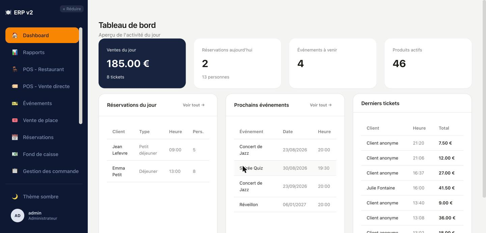
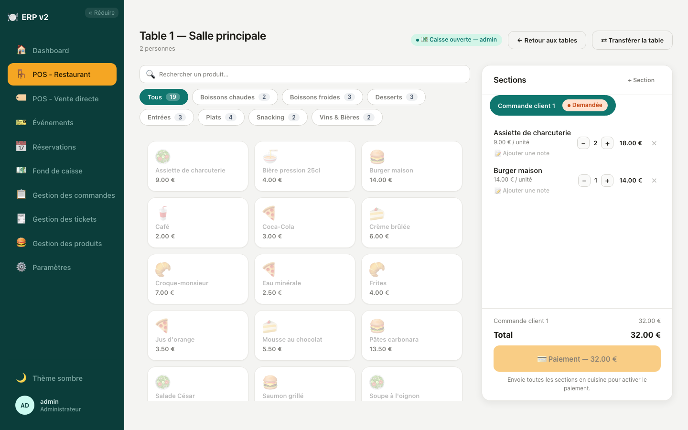
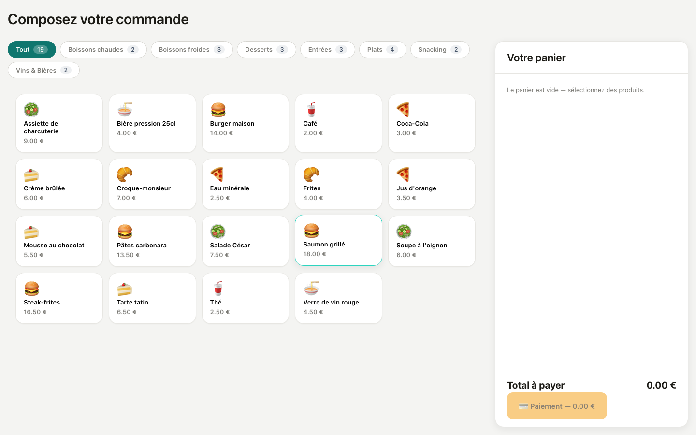

# ERP v2

<p align="center">
  
  
  
</p>

> 📖 Une visite guidée illustrée (captures d'écran de chaque app) est disponible dans
> [`docs/README.md`](docs/README.md). Ce fichier-ci reste la référence technique brute (schéma
> de base de données, liste exhaustive des fonctionnalités).

ERP maison pour un établissement qui fait à la fois vente directe (snack/comptoir), restaurant
avec service à table, location de salle pour événements, et commande en libre-service (QR à
table/chambre ou kiosque façon fast-food). Sept applications séparées partageant une seule base de
données et une seule API.

## Architecture

| App | Rôle | Stack | Port (dev) |
|---|---|---|---|
| `erp-api` | API REST + diffusion temps réel | Laravel 13 / PHP 8.4 / MySQL 8.4 | 19001 |
| `erp-api` (service `reverb`) | Serveur WebSocket (Laravel Reverb) | même image que `erp-api` | 19004 |
| `erp-app` | Back-office admin (POS, Paramètres, Événements, Réservations, Caisse, Tickets) | Angular 22 | 19002 |
| `erp_validate_event` | Kiosque : validation d'entrée événement par QR code | Angular 22 | 19003 |
| `erp_kitchen_display` | Kiosque : écran cuisine (postes + passes) | Angular 22 | 19005 |
| `erp_self_order` | Commande client (QR à table ou en chambre) — 100% public, aucune authentification | Angular 22 | 19006 |
| `erp_kiosk` | Kiosque de commande self-service façon fast-food (staff authentifié, encaissement immédiat) + écran de suivi | Angular 22 | 19007 |
| `erp_public_site` | Site vitrine public (présentation, réservation restaurant, à terme billetterie événements) — 100% public, aucune authentification | Angular 22 | 19008 |
| `erp_public_shop` | Boutique en ligne (retrait ou livraison, paiement Stripe Checkout) — 100% public, aucune authentification | Angular 22 | 19009 |

`erp_self_order` a délibérément été séparé du mode kiosque dans sa propre app : c'est la seule
surface exposée à un appareil client non maîtrisé (téléphone personnel scannant un QR), elle ne
doit donc jamais embarquer le moindre code d'authentification/caisse — celui-ci vit uniquement
dans `erp_kiosk`, avec l'écran de suivi (les numéros affichés y viennent des tickets kiosque, pas
du mode QR — voir `docs/README.md`). `erp_public_site` et `erp_public_shop` sont, comme
`erp_self_order`, exposées à un visiteur anonyme non maîtrisé — mêmes garde-fous (routes API
publiques dédiées, jamais les routes staff `auth:sanctum`, voir plus bas). `erp-app`,
`erp_validate_event`, `erp_kitchen_display` et
`erp_kiosk` sont des **kiosques/écrans dédiés** (pas d'authentification multi-rôle fine — voir
Todo) qui parlent tous à la même `erp-api`. `erp-app`, `erp_kitchen_display`, `erp_kiosk`
(écran de suivi) et `erp_public_shop` (confirmation de paiement) s'abonnent en plus au serveur
`reverb` via Laravel Echo pour se synchroniser en temps réel entre eux (voir plus bas).

Adminer (client web MySQL) est aussi lancé par `docker-compose.yml`, sur le port 19080 —
pratique pour inspecter la base pendant le développement.

## Démarrer le projet

```bash
cp .env.example .env      # déjà fait si vous lisez ceci depuis un clone existant
docker compose up -d --build
```

- API : http://localhost:19001
- Back-office (`erp-app`) : http://localhost:19002
- Validation événement (`erp_validate_event`) : http://localhost:19003
- Kitchen display (`erp_kitchen_display`) : http://localhost:19005
- Self-order (`erp_self_order`) : http://localhost:19006
- Kiosk (`erp_kiosk`) : http://localhost:19007
- Site public (`erp_public_site`) : http://localhost:19008
- Boutique en ligne (`erp_public_shop`) : http://localhost:19009
- Adminer : http://localhost:19080 (serveur `db`, voir `.env` pour les identifiants)

Au premier démarrage, `docker/entrypoint.sh` du conteneur `api` lance automatiquement
`migrate` + les seeders de base (rôles, stations, passes, taxes, catégories/catalogues produit,
moyens de paiement, utilisateur admin). Identifiants admin par défaut définis dans `.env`
(`ADMIN_USERNAME`/`ADMIN_EMAIL`/`ADMIN_PASSWORD`, `admin` / `admin@erp.local` / `password`).
Mettre `DEMO=true` dans `.env` avant le premier démarrage pour peupler aussi un plan de salle,
des clients et un catalogue produit de démonstration (`DemoSeeder`).

**Piège connu** : `erp-api` (contrairement aux 3 apps Angular, bind-mountées et rechargées à
chaud) n'a **aucun bind mount** — le code PHP est cuit dans l'image au build. Toute modification
côté `erp-api`/`routes`/migrations nécessite `docker compose build api reverb && docker compose
up -d api reverb` pour être prise en compte par les conteneurs déjà démarrés.

## Déploiement en production

> Préparation du VPS (accès, sécurité de base, DNS, Docker) avant ce qui suit : voir
> [`docs/deploy-ovh.md`](docs/deploy-ovh.md) (rédigé pour OVH, mais générique à n'importe quel VPS
> Ubuntu à partir de l'étape Docker).

`docker-compose.yml` (dev) sert les 5 apps Angular via `ng serve` — "un serveur simple pour tester
en local, pas revu pour des questions de sécurité" selon son propre avertissement — donc jamais en
prod tel quel. `docker-compose.prod.yml` est un fichier **séparé et autonome** (pas un override du
compose dev) : builds Angular optimisés servis par nginx, `erp-api` durci (`APP_DEBUG=false`,
cache config/route/vue), CORS restreint aux vrais domaines, et un reverse-proxy
[Caddy](https://caddyserver.com/) devant tout qui gère le HTTPS automatiquement (Let's Encrypt).

Cible : **un seul VPS**, un domaine dont les sous-domaines pointent vers son IP (enregistrements
DNS A) : `api.`, `app.`, `kiosk.`, `self-order.`, `kitchen.`, `validate-event.`, `shop.`, `ws.` (Reverb).
L'apex du domaine (sans sous-domaine, `mondomaine.tld`) pointe aussi vers la même IP et sert
`erp_public_site` — c'est l'adresse destinée au grand public, contrairement aux sous-domaines
ci-dessus qui restent internes (staff/kiosques).

### Comment ça tient ensemble

Les apps Angular ne peuvent plus dériver `API_URL`/`REVERB_*` de `window.location.hostname` +
port codé en dur comme en dev (pas de "port 19001" en prod, juste `api.mondomaine.tld` en
HTTPS/443). À la place, chaque image `Dockerfile.prod` sert un build statique (nginx) dont
l'entrypoint génère un `env.js` à partir des variables d'environnement du conteneur, chargé avant
le bundle Angular (voir `docker/env.template.js` de chaque app) — `core/api-config.ts`/
`core/reverb-config.ts` lisent `window.__ERP_CONFIG__` s'il existe, sinon retombent sur le
comportement dev actuel. Une seule image par app, redéployable sur n'importe quel domaine juste en
changeant `.env`.

### Process

1. Sur le VPS : `git clone`.
2. Préparer le `.env` de prod (fichier local au VPS, jamais commité — voir `.gitignore`).
   Deux façons de faire :
   - **Rapide** : partir de `.env.production` (déjà rempli avec des secrets générés —
     `APP_KEY`, `REVERB_APP_KEY`/`SECRET`, mots de passe DB/admin — préparé pour ce repo, à ne
     jamais committer). Il ne manque que `DOMAIN`/`ACME_EMAIL` et éventuellement `MAIL_*`. Puis
     `cp .env.production .env` — `docker compose` (interpolation des `${DOMAIN}` etc. dans
     `docker-compose.prod.yml`) ne lit que le fichier littéralement nommé `.env` dans le dossier
     courant, pas `.env.production` directement.
   - **Depuis zéro** : `cp .env.production.example .env` puis remplir chaque valeur marquée
     `CHANGEME_*` — checklist :
     - `APP_ENV=production`, `APP_DEBUG=false`, `DEMO=false`
     - `DB_PASSWORD`/`DB_ROOT_PASSWORD`/`ADMIN_PASSWORD` : vraies valeurs, pas celles du repo
     - `APP_KEY` régénéré : `docker compose -f docker-compose.prod.yml run --rm api php artisan key:generate --show`, coller le résultat
     - `REVERB_APP_KEY`/`REVERB_APP_SECRET` régénérés (chaînes aléatoires — `openssl rand -hex 16`/`openssl rand -hex 20`)
     - `DOMAIN=mondomaine.tld` et `ACME_EMAIL=vous@mondomaine.tld` (requis par Let's Encrypt)
     - Vérifier `MAIL_*` (des vrais identifiants SMTP, pas ceux de dev)
3. `docker compose -f docker-compose.prod.yml up -d --build`.
4. Vérifier l'émission des certificats : `docker compose -f docker-compose.prod.yml logs caddy` — Caddy les provisionne au premier accès à chaque sous-domaine, ça peut prendre 30s-1min.
5. Tester chaque sous-domaine dans un navigateur.

**Piège à ne pas reproduire** (vécu en dev avec `APP_KEY` vide) : éditer `.env` puis `docker
compose -f docker-compose.prod.yml restart` **ne suffit pas** — `restart` relance le même
conteneur avec l'environnement figé au démarrage précédent. Toute modification de `.env` exige
`docker compose -f docker-compose.prod.yml up -d` (recrée les conteneurs concernés).

**Mise à jour de l'app** : `git pull && docker compose -f docker-compose.prod.yml up -d --build`.

**Sauvegardes** : aucun script fourni — un `mysqldump` en cron suffit largement à cette échelle,
ex. `docker compose -f docker-compose.prod.yml exec -T db mysqldump -uroot -p$DB_ROOT_PASSWORD
$DB_DATABASE | gzip > backup-$(date +%F).sql.gz`.

**Adminer n'est pas déployé en prod** (pas de client MySQL web exposé publiquement). Pour une
inspection ponctuelle : `docker compose -f docker-compose.prod.yml exec db mysql -u root -p`, ou
un tunnel SSH vers le port 3306 du conteneur `db` depuis le poste local.

## Temps réel (Laravel Echo / Reverb)

Deux canaux publics Reverb :

- `kitchen`, événement `order.updated` (voir `App\Events\OrderKitchenUpdated`), diffusé à
  **chaque mutation d'une commande** (table ouverte, section créée/validée/demandée/marquée
  faite/envoyée/supprimée, produit ajouté/modifié/retiré, commande payée/annulée). Deux familles
  d'abonnés :
  - `erp_kitchen_display` (`kitchen-board.ts`) : refetch générique de la liste à chaque événement.
  - `erp-app` POS - Restaurant (`table-select.ts`, `order-builder.ts`) : `table-select.ts` refetch
    l'occupation des tables à chaque événement ; `order-builder.ts` ne refetch que si l'id de
    commande correspond à celle actuellement ouverte — permet à plusieurs instances de POS -
    Restaurant (plusieurs serveurs, plusieurs postes) de rester synchronisées sans recharger la
    page, y compris quand une commande est payée ou annulée depuis un autre poste.
- `kiosk-checkout.{id}`, événement `KioskCheckoutPaid` — confirmation temps réel du paiement QR du
  kiosque (voir section ERP Kiosk plus bas) : `erp_kiosk` s'y abonne le temps d'attendre le
  paiement, avec un polling de secours (`GET /kiosk-checkouts/{id}`) si l'appareil rate l'event
  (websocket coupé — un kiosque n'est pas surveillé).

`ShouldBroadcastNow` (pas de queue worker actif dans ce projet) : la diffusion est synchrone,
dans la même requête HTTP que la mutation qui la déclenche.

## Base de données

Conventions communes : `active` (booléen, défaut `true`) sur les tables de référence listées
ci-dessous signifie qu'il n'y a **plus de suppression possible** depuis l'app — seulement une
désactivation. Les composants qui affichent ces entités (listes déroulantes, plans de salle...)
n'affichent que les lignes actives (sauf exception documentée au cas par cas, ex. filtre
d'historique). `slug` est dérivé automatiquement de `name` à la création (voir `HasSlug`).

**Identité / accès**
- `roles` : name, slug, active
- `users` : username, password, email, barcode (secret du QR de connexion), active
- `role_user` (pivot) : user_id, role_id

**Cuisine**
- `stations` : name, slug, passe_id (nullable — choisi depuis le formulaire Station ; plusieurs
  stations peuvent partager le même passe), active
- `passes` : name, slug, active

**Catalogue produit**
- `payment_methods` : name, slug, active
- `taxes` : slug, value, active
- `product_categories` : name, slug, active, icon (emoji, nullable), image_path (chemin relatif
  sur le disque `public`, nullable — mutuellement exclusif avec `icon`, voir `App\Support\ImageUpload`)
- `product_catalogs` : name, slug, active, active_restaurant, active_direct_sale, active_kiosk,
  active_self_order (les quatre indépendants de `active` et indépendants entre eux : chacun
  désigne si ce catalogue fait partie de ceux *actuellement affichés* pour ce contexte POS —
  **plusieurs catalogues peuvent être actifs en même temps pour un même contexte** (pas une
  sélection exclusive), le contexte affiche alors l'union des produits de tous ses catalogues
  actifs (voir `ProductCatalogController@setActiveForX`, `Paramètres > Catalogues`))
- `products` : name, slug, description, price, sku, active, is_combo, tax_id, station_id,
  product_category_id, icon (emoji, nullable), image_path (nullable, même principe que
  `product_categories` ci-dessus) — plus `catalog_product` (pivot many-to-many vers
  `product_catalogs`)
- `product_components` : combo_id (FK `products`, le produit `is_combo=true`), component_product_id
  (FK `products`, un produit normal — pas de combo imbriqué dans un combo), quantity — composition
  d'un menu/formule ; à la commande, un combo est éclaté en une ligne `order_line` par composant
  (taguée `combo_id`), jamais ajouté comme une ligne opaque, pour que la cuisine voie chaque
  composant séparément

**Clients**
- `clients` : firstname, lastname, email, phone, points_balance (solde de points fidélité — voir
  section Programme de fidélité plus bas, colonne dénormalisée mise à jour uniquement par
  `App\Support\LoyaltyPoints`, jamais en écriture directe)
- `client_point_movements` : client_id, ticket_id (nullable), points (signé — positif = gagné,
  négatif = utilisé) — historique des mouvements, consulté depuis la fiche client 360°
  (`/clients/:id`) ; `clients.points_balance` reste la valeur de référence pour l'affichage
  courant, pas recalculée depuis cette table à chaque lecture

**Plan de salle**
- `rooms` : name, slug, type (`restaurant` | `event`), active
- `tables` : type, label, pos_left, pos_top, width, height, room_id, active

**POS - Restaurant (commande en cours, avant paiement)**
- `orders` : state (send → ask → do → seed → done, jamais atteint pour l'instant — voir plus
  bas), client_id (nullable), table_id, number_of_guests
- `order_sections` : name, state (en_attente → send → ask → do → seed — "en_attente" = pas
  encore validée, avant même d'entrer dans le cycle nommé ; "done" jamais atteint), order_id
- `order_lines` : quantity, product_id, combo_id (nullable, FK `products` — renseigné quand cette
  ligne est un composant éclaté d'un combo, voir `product_components` plus haut), note (nullable),
  order_section_id, done (le poste a préparé cette ligne — suivi par ligne, pas par section, une
  section peut mélanger plusieurs postes), sent (le passe a expédié cette ligne — idem par ligne,
  une section peut mélanger plusieurs passes), is_correction (voir `OrderController::correction` —
  une fois toutes les sections envoyées en cuisine, "un produit en trop" ne peut plus être
  supprimé/décrémenté normalement (garde-fou anti-désync avec ce que la cuisine a préparé) ; une
  correction ajoute une NOUVELLE ligne du même produit flaguée `is_correction`, jamais renvoyée en
  cuisine (`done`/`sent` forcés à `true`), dont la quantité est déduite du total au paiement)

**Tickets (commande payée — figé, lecture seule)**
- `tickets` : paid_at, client_id (nullable), table_id (nullable — vente directe n'a pas de table),
  discount_id (nullable), discount_amount (nullable), points_earned (nullable — points fidélité
  gagnés sur cette vente), points_redeemed (nullable), points_redeemed_amount (nullable) — les
  trois derniers figés au paiement, comme `discount_amount` (voir programme de fidélité plus bas)
- `ticket_sections` : name, ticket_id
- `ticket_lines` : quantity, unit_price (figé au prix du produit au moment du paiement),
  note (nullable), is_correction (même principe que `order_lines.is_correction` — toujours stocké
  avec une `quantity` positive, le signe est appliqué au moment du calcul, ex. dans
  `ReportController` pour le CA), product_id, ticket_section_id
- `ticket_payments` : value, payment_method_id, ticket_id, user_id (nullable), cash_session_id
  (nullable) — un ticket peut avoir plusieurs paiements (règlement partagé espèces/carte)
- `kiosk_checkouts` : stripe_checkout_session_id (unique), status (`pending`/`paid`/...),
  cash_session_id, client_id (nullable), discount_id/discount_amount (nullable),
  points_earned/points_redeemed/points_redeemed_amount (nullable), lines (json, figé au moment du
  scan), total, ticket_id (nullable, pas de contrainte FK — simple repère une fois la vente
  matérialisée) — voir section paiement kiosque plus bas ; contrairement à `tickets`, existe
  *avant* que la vente soit confirmée (créé au scan du QR, matérialisé en `Ticket`/`Order` réels
  seulement une fois le webhook Stripe reçu)

**Événements**
- `events` : name, slug, active
- `event_dates` : date, start_hour, event_id, room_id (nullable — placement libre si absent),
  number_place_limit (nullable), active
- `event_tickets` : event_date_id, client_id (nullable), table_id (nullable — attribué au
  check-in si placement strict), validation_code, validated_at (nullable)

**Réservations**
- `bookings` : client_id, number_of_guests, type (`breakfast` | `lunch` | `dinner`), date, hour,
  validated_at (nullable)

**Caisse**
- `cash_sessions` : user_id, opening_amount, opened_at, closing_amount (nullable),
  expected_amount (nullable), discrepancy (nullable), closed_at (nullable),
  closed_by_user_id (nullable), note (nullable)
- `cash_session_counts` : cash_session_id, payment_method_id, expected_amount, counted_amount,
  discrepancy (détail du comptage à la fermeture, par moyen de paiement)

**Réductions**
- `discounts` : code (unique), type (`percentage` | `fixed_amount` | `free_product`), value
  (nullable — pourcentage 0-100 ou montant en €, absent pour `free_product`), minimum_total
  (nullable — seuil d'éligibilité : montant d'achat minimum requis pour utiliser le code ; une
  fois atteint la réduction s'applique toujours en entier, jamais plafonnée), free_product_id
  (nullable FK produits), starts_at, ends_at (période de validité, bornes incluses), active — le
  calcul (`App\Support\DiscountCalculator`) est partagé entre l'aperçu live
  (`POST /discounts/validate`) et les 3 endroits où un paiement est réellement encaissé
  (`TicketController::store`, `OrderController::pay`, `KioskOrderController::store`) : le serveur
  ne fait jamais confiance à un montant de réduction envoyé par le client
- `tickets.discount_id` (nullable FK discounts), `tickets.discount_amount` (nullable — montant
  déduit, figé au moment du paiement comme le reste du ticket)

## Programme de fidélité

`App\Support\LoyaltyPoints` : 1 point gagné par € dépensé, 100 points = 5€ de réduction (taux
fixes, pas de configuration en base pour l'instant). Contrairement aux codes de réduction
(réservés à superviseur+), **les points sont utilisables par n'importe quel rôle** — décision
explicite : ce n'est pas une dérogation commerciale décidée au comptoir comme un code promo, juste
la conversion d'un solde déjà acquis par le client. Si les points demandés dépassent ce qu'il
resterait à payer, la vente est **rejetée** (422), jamais silencieusement plafonnée — comportement
volontairement différent d'un code promo qui, lui, se plafonne au total. Intégré aux 5 points
d'encaissement (`TicketController::store`, `OrderController::pay`, `KioskOrderController::store`,
`KioskCheckoutController::store` + `StripeWebhookController` pour la confirmation asynchrone),
cumulable avec un code de réduction sur la même vente. Consultable en détail depuis la fiche
client 360° (`/clients/:id`), qui liste `client_point_movements`.

## ERP_APP (back-office)

- ✅ Dashboard
    1. ✅ Afficher des stats

- ✅ POS - Vente directe
    1. ✅ Vente directe de produits
    2. ✅ Possibilité de sélectionner un client (optionnel)
    3. ✅ Paiements
    4. ✅ Application d'un code de réduction au paiement (recalculé côté serveur, jamais confiance
       dans le montant affiché côté front)
    5. ✅ Redemption de points fidélité en réduction, cumulable avec un code promo (voir section
       Programme de fidélité plus haut)

- ✅ POS - Restaurant
    1. ✅ Affiche les plans de salle avec un sélecteur de salle (uniquement les salles de type
       resto) et la possibilité d'ouvrir une table avec le nombre de personnes
    2. ✅ Affiche le POS une fois la table ouverte pour sélectionner des produits
    3. ✅ Sélectionner des produits et les séparer en sections, pouvoir ajouter des sections
       (section 1, section 2, ...)
    4. ✅ Une fois les produits sélectionnés — repasser sur la sélection des tables (home POS -
       Restaurant)
    5. ✅ Paiement avec possibilité de payer une partie en espèces et une partie en Bancontact —
       affiche le rendu en espèces
    6. ✅ Application d'un code de réduction au paiement (idem POS - Vente directe)
    7. ✅ Redemption de points fidélité en réduction (idem POS - Vente directe)
    8. ✅ Possibilité d'imprimer le ticket de caisse (mise en page façon vrai ticket de caisse) et
       de l'envoyer par email si un client est sélectionné
    9. ✅ Correction de commande : une fois toutes les sections envoyées en cuisine ('seed'), un
       produit rentré en trop peut être retiré de l'addition sans désynchroniser ce que la cuisine
       a réellement préparé — ajoute une ligne de correction déduite du total plutôt que de
       supprimer la ligne d'origine (voir `OrderController::correction`, DB `order_lines.is_correction`)
    10. ✅ Chaque section suit un cycle (en_attente → send → ask → do → seed → done, "en_attente" =
       pas encore validée, "done" jamais atteint pour l'instant) :
        - ✅ valider → send → envoyée sur le kitchen display
        - ✅ demander en cuisine → ask → demande la section en cuisine
        - ✅ fait → do → la station correspondant au produit marque la section comme faite (par
          ligne, pas toute la section si elle mélange plusieurs postes)
        - ✅ envoyer → seed → le passe correspondant marque la section comme envoyée (par ligne
          aussi, si la section mélange plusieurs passes)
        - done (jamais atteint, réservé pour une étape future — ex. "physiquement servie en
          salle")
    11. ✅ Synchronisation temps réel entre plusieurs instances de POS - Restaurant (Laravel
       Echo/Reverb) : ouverture/libération d'une table, ajout de produit, section validée, et
       paiement se répercutent en direct sur les autres postes ouverts sur la même commande ou
       sur l'écran de sélection de table, sans recharger la page

- ✅ Gestion des tickets
    1. ✅ Historique des tickets payés (filtre par jour, par client)
    2. ✅ Détail d'un ticket (`/tickets/:id`)
    3. ✅ Réimpression d'un ticket — consultation et réimpression uniquement, pas de modification
       ni de suppression (un ticket payé est une pièce comptable figée)
    4. ✅ Si une réduction a été appliquée : ligne dédiée sur le ticket imprimé/détail et total
       affiché net (montant réellement encaissé, pas le total brut du panier)

- ✅ Event
    1. ✅ Vendre des places (liées à un client) pour un événement, créer un code de validation,
       possibilité de l'envoyer par email — page dédiée `/vente-de-places`, **top-level, séparée
       de `/evenements`** (gestion des events eux-mêmes) plutôt que nichée dessous
    2. ✅ Liste des places vendues avec modification et suppression, vue liste ou calendrier (toggle),
       nombre de places vendues/restantes affiché par date
    3. ✅ Valider la présence avec le code de validation et attribuer une place (si placement
       strict, room_id disponible)
    4. ✅ Affichage d'une salle avec les places prises (room)

- ✅ Réservation
    1. ✅ Enregistrer une réservation (client, type, date, heure au quart d'heure, nombre de
       personnes) — type enum (petit-déjeuner, déjeuner, souper)
    2. ✅ Liste des réservations avec tri et filtre par jour
    3. ✅ Valider la réservation d'un client

- ✅ Produits
    1. ✅ Gestion des produits en vente
    2. ✅ Possibilité de tri et de filtre
    3. ✅ Recherche par nom
    4. ✅ Miniature (image ou icône emoji, au choix) affichée dans la liste
    5. ✅ Combos/menus : un produit `is_combo` composé de plusieurs autres (voir DB
       `product_components`) — éclaté en une ligne par composant à la commande, pas une ligne
       opaque, pour que la cuisine voie chaque composant séparément

- ✅ Gestion des clients
    1. ✅ CRUD complet (recherche/création rapide depuis les POS déjà existante par ailleurs)
    2. ✅ Fiche client 360° (`/clients/:id`) : coordonnées, solde de points fidélité, historique
       des mouvements de points, historique des tickets

- ✅ Rapports
    1. ✅ Comparaison de période (jour/semaine/mois vs même durée écoulée sur la période
       précédente — pas la période précédente entière) : chiffre d'affaires, nombre de ventes
    2. ✅ Meilleures ventes par chiffre d'affaires sur la période sélectionnée

- ✅ Ouverture / Fermeture de caisse
    1. ✅ Ouverture de session avec montant en cash
    2. ✅ Fermeture : validation du cash et des autres moyens de paiement
    3. ✅ Liste des fermetures avec détail

- ✅ Paramètres
    1. ✅ Gérer les salles et les tables (position des tables, ajout de salle)
    2. ✅ Gérer les catégories de produits — image ou icône emoji au choix (mutuellement exclusifs)
    3. ✅ Gérer les catalogues de produits — **plusieurs catalogues activables simultanément par
       contexte** (POS Restaurant/POS Vente directe/Kiosque/Commande QR, indépendants les uns des
       autres) plutôt qu'un seul catalogue exclusif par contexte ; le contexte affiche alors
       l'union des produits de tous ses catalogues actifs
    4. ✅ Gérer les utilisateurs (CRUD complet) et leur attribuer un ou plusieurs des trois rôles
       fixes (admin/superviseur/user, voir RoleSeeder) — les rôles eux-mêmes sont en lecture seule
       depuis l'app, pas de création/modification (`RoleController` n'expose que index/show).
       Chaque rôle a un périmètre fixe (voir `EnsureUserHasRole` côté API, `role.guard.ts` côté
       front) : **admin** a accès à tout, y compris Paramètres ; **superviseur** a accès à tout
       sauf Paramètres (caisse, rapports/historiques — tickets —, réductions au paiement,
       corrections de commande, gestion des événements/produits/clients) ; **user** a accès aux
       deux POS, à Gestion des commandes, à Réservations et à Vente de place (vendre une place
       sur une occurrence déjà créée — créer/modifier un événement ou ses dates reste
       superviseur+), mais pas de réduction ni de correction possibles, pas d'ouverture/fermeture
       de session de caisse (juste vendre une fois qu'un superviseur en a ouvert une), et pas
       accès à Paramètres/Dashboard/Événements (gestion)/Fond de caisse/Gestion des
       tickets/Gestion des produits/Gestion des clients. Le serveur reste la seule vraie barrière
       — le front ne fait que cacher les actions non permises pour ne pas laisser deviner un 403.
    5. ✅ Gestion des produits
    6. ✅ Gérer les stations (CRUD + choix du passe de chaque station)
    7. ✅ Gérer les passes (CRUD)
    8. ✅ Gérer les réductions (code, type pourcentage/montant fixe/produit gratuit, seuil
       d'éligibilité optionnel, période de validité) — utilisables au paiement dans POS - Vente
       directe, POS - Restaurant et Kiosk (`erp_self_order` ne gère jamais de paiement lui-même,
       donc n'a pas besoin d'UI dédiée — voir `## ✅ ERP Self Order`)
    9. ✅ Plus de suppression pure sur salles/tables/catégories/catalogues/utilisateurs/
       stations/taxes/passes/réductions — remplacée par une case "Actif"
       (activer/désactiver), pour éviter les suppressions en cascade sur des entités très
       référencées ailleurs dans l'app

## ✅ ERP Validate event

- ✅ Sectionner un événement (plusieurs dates)
- ✅ Valider les places par QR code
- ✅ Placer les gens si événement avec placement strict

## ✅ Kitchen display

- ✅ Possibilité de voir Tout
- ✅ Tous les postes, poste par poste
- ✅ Toutes les passes, passe par passe (chaque station pointe vers son passe, plusieurs stations
  peuvent partager le même passe)
- ✅ Marquer comme fait dans les postes (uniquement les postes — pas les passes)
- ✅ Marquer comme envoyé dans les passes (uniquement les passes — pas les postes)
- ✅ Panneau "à préparer" : résumé des produits en attente/en cours, restreint à la perspective du
  poste courant (ne montre que ce que ce poste a réellement à préparer)

## ✅ ERP Self Order

- ✅ Mode QR : scan du QR code d'une table (ou référence générique, réutilise tables/rooms),
  compose sa commande sans s'authentifier, jamais de paiement — passe directement en "demandée"
  en cuisine — app 100% publique, aucune authentification embarquée (voir `erp_kiosk` pour le
  mode staff)
- ✅ Génération automatique d'un QR code imprimable par table (`erp-app` > Paramètres > Salles)
- ✅ Minuteur de préparation par section en cuisine, basé sur `products.preparation_time`
- ✅ Champ `source` sur les tickets (vente directe / POS Restaurant / self-order / kiosque)

## ✅ ERP Kiosk

- ✅ App séparée de `erp_self_order` pour des raisons de sécurité : le code d'authentification et
  d'encaissement du kiosque n'est jamais servi à un appareil client (voir mode QR ci-dessus)
- ✅ Appareil authentifié (staff), catalogue self-order (union des catalogues actifs pour ce
  contexte, voir Paramètres > Catalogues), ticket + numéro de commande imprimable, visible en
  cuisine malgré le paiement anticipé (`KioskOrderController`, voir `docs/README.md`)
- ✅ Deux variants de paiement, un seul moyen possible par vente (pas de split, contrairement aux
  deux POS `erp-app`) :
  - **Terminal** : reste entièrement simulé (`KioskOrderController`) — un vrai terminal Bancontact
    nécessiterait le SDK Stripe Terminal, hors périmètre pour l'instant.
  - **QR code** : vrai paiement Stripe Checkout (Bancontact) — le client scanne avec son propre
    téléphone et paie via sa banque, sur un appareil séparé du kiosque. Bancontact confirme "en
    direct" côté Stripe (`checkout.session.completed`, pas un vrai async_payment_*) mais reste
    découplé de la requête HTTP initiale : le kiosque a déjà affiché le QR bien avant que le
    paiement soit confirmé. `KioskCheckoutController` fige la vente dans un `KioskCheckout`
    `pending` au moment du scan ; `StripeWebhookController` la matérialise (Ticket + Order, via
    `App\Support\KioskSaleRecorder`, même logique que le variant Terminal) une fois le webhook
    reçu, avec confirmation temps réel côté kiosque via Reverb (canal `kiosk-checkout.{id}`) et
    un polling de secours (`GET /kiosk-checkouts/{id}`) si l'appareil rate l'event.
- ✅ "Connexion" client optionnelle par téléphone (`GET /clients/lookup`, correspondance exacte
  uniquement) — pas de liste de clients ni de recherche libre comme sur les POS `erp-app` (fuite
  de confidentialité inacceptable sur un appareil public) : trouvé → sélectionné directement,
  sinon → proposition de créer un compte avec ce numéro
- ✅ Application d'un code de réduction et/ou de points fidélité au paiement (idem POS - Vente
  directe / POS - Restaurant, voir section Programme de fidélité plus haut)
- ✅ Écran public "suivi des commandes" (numéros en préparation / prêts, tickets kiosque
  uniquement), temps réel via Reverb — seule partie de cette app sans authentification

## Todo

- ~~Définir ce qui est disponible de faire avec les différents rôles utilisateur~~ fait (voir
  Paramètres > 4 ci-dessus) — reste à vérifier que le staff qui valide les entrées via
  `erp_validate_event` a bien un compte superviseur+ (le rôle `user`, volontairement limité aux
  deux POS, ne peut plus valider de billet depuis ce changement)
