# ERP v2 — documentation du projet

ERP maison pour un établissement qui combine vente directe (snack/comptoir), restaurant avec
service à table, location de salle pour événements, **et commande en libre-service** (client
scanne un QR à table/chambre, ou utilise un kiosque façon fast-food). Six applications séparées
partageant une seule base de données et une seule API.

Ce document est une visite guidée illustrée de chaque application. Pour les détails techniques
bruts (schéma de base de données complet, conventions, liste des fonctionnalités livrées), voir
le [`Readme.md`](../Readme.md) à la racine du projet.

## Sommaire

- [Première configuration — que créer, dans quel ordre](premiere-configuration.md)
- [Architecture](#architecture)
- [Démarrer le projet](#démarrer-le-projet)
- [Temps réel (Laravel Echo / Reverb)](#temps-réel-laravel-echo--reverb)
- [`erp-app` — back-office admin & POS](#erp-app--back-office-admin--pos)
- [`erp_kitchen_display` — écran cuisine](#erp_kitchen_display--écran-cuisine)
- [`erp_validate_event` — validation d'entrée événement](#erp_validate_event--validation-dentrée-événement)
- [`erp_self_order` — commande en libre-service](#erp_self_order--commande-en-libre-service)
- [`erp_kiosk` — kiosque de commande self-service](#erp_kiosk--kiosque-de-commande-self-service)
- [Le minuteur de préparation](#le-minuteur-de-préparation)
- [Limitations connues](#limitations-connues)

## Architecture

| App | Rôle | Stack | Port (dev) |
|---|---|---|---|
| `erp-api` | API REST + diffusion temps réel | Laravel 13 / PHP 8.4 / MySQL 8.4 | 19001 |
| `erp-api` (service `reverb`) | Serveur WebSocket (Laravel Reverb) | même image que `erp-api` | 19004 |
| `erp-app` | Back-office admin (POS, Paramètres, Événements, Réservations, Caisse, Tickets) | Angular 22 | 19002 |
| `erp_validate_event` | Kiosque : validation d'entrée événement par QR code | Angular 22 | 19003 |
| `erp_kitchen_display` | Kiosque : écran cuisine (postes + passes) | Angular 22 | 19005 |
| `erp_self_order` | Commande client (scan QR à table/chambre) — 100% public | Angular 22 | 19006 |
| `erp_kiosk` | Kiosque de commande self-service façon fast-food (staff authentifié) + écran de suivi | Angular 22 | 19007 |

`erp_self_order` n'a besoin d'aucune authentification — un client anonyme scanne un code et
compose sa commande depuis son propre téléphone. C'est précisément pour ça que le mode kiosque vit
dans une app séparée, `erp_kiosk` : le bundle servi à un appareil client ne doit jamais contenir de
code d'authentification/caisse. L'écran de suivi des commandes vit lui aussi dans `erp_kiosk` (les
numéros affichés viennent des tickets kiosque, voir plus bas), même s'il ne demande pas
d'authentification. `erp-app`, `erp_kitchen_display` et `erp_kiosk` s'abonnent au serveur `reverb`
via Laravel Echo pour se synchroniser en temps réel entre eux.

Adminer (client web MySQL) tourne aussi via `docker-compose.yml`, sur le port 19080.

## Démarrer le projet

```bash
cp .env.example .env      # déjà fait si vous lisez ceci depuis un clone existant
docker compose up -d --build
```

- API : http://localhost:19001
- Back-office (`erp-app`) : http://localhost:19002
- Validation événement (`erp_validate_event`) : http://localhost:19003
- Kitchen display (`erp_kitchen_display`) : http://localhost:19005
- Self-order (`erp_self_order`) : http://localhost:19006
- Kiosk (`erp_kiosk`) : http://localhost:19007
- Adminer : http://localhost:19080

Identifiants admin par défaut (`.env`) : `admin` / `password`. Mettre `DEMO=true` dans `.env`
avant le premier démarrage pour peupler un plan de salle, des clients et un catalogue produit de
démonstration.

**Piège connu** : `erp-api` n'a aucun bind mount (contrairement aux 5 apps Angular, rechargées à
chaud) — toute modification côté API nécessite `docker compose build api reverb && docker compose
up -d api reverb`.

## Temps réel (Laravel Echo / Reverb)

Un seul canal public Reverb, `kitchen`, événement `order.updated` (voir
`App\Events\OrderKitchenUpdated`), diffusé à chaque mutation d'une commande (table ouverte,
section validée/demandée/marquée faite/envoyée, commande payée/annulée, commande kiosque créée...).
Trois familles d'abonnés :

- `erp_kitchen_display` : refetch générique de la liste des commandes à chaque événement.
- `erp-app` POS - Restaurant : synchronise plusieurs postes ouverts sur la même salle/commande.
- `erp_kiosk` (écran "suivi des commandes") : même canal public, sans authentification pour cette
  page précise — juste des numéros de ticket déjà remis au client, rien de sensible. Le reste de
  `erp_kiosk` (login, setup, commande) n'écoute pas ce canal : il crée la commande et l'encaisse en
  une seule requête, sans avoir à refléter son état ensuite.

---

## `erp-app` — back-office admin & POS

Connexion par identifiant/mot de passe ou par scan d'un QR personnel.

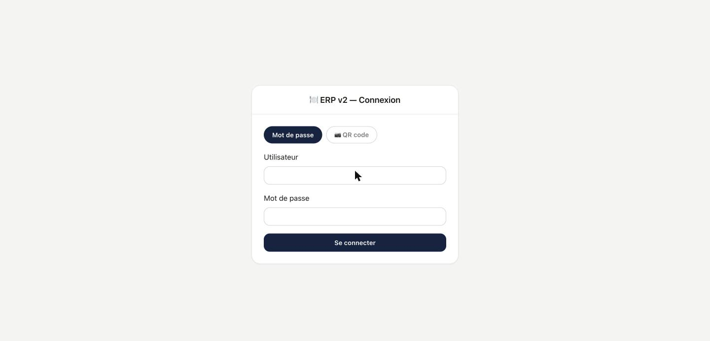

Une fois connecté, le tableau de bord et la barre latérale donnent accès à tous les modules :


### POS - Restaurant

Sélection de table à partir du plan de salle (une salle par onglet, uniquement les salles de type
"Restaurant") :

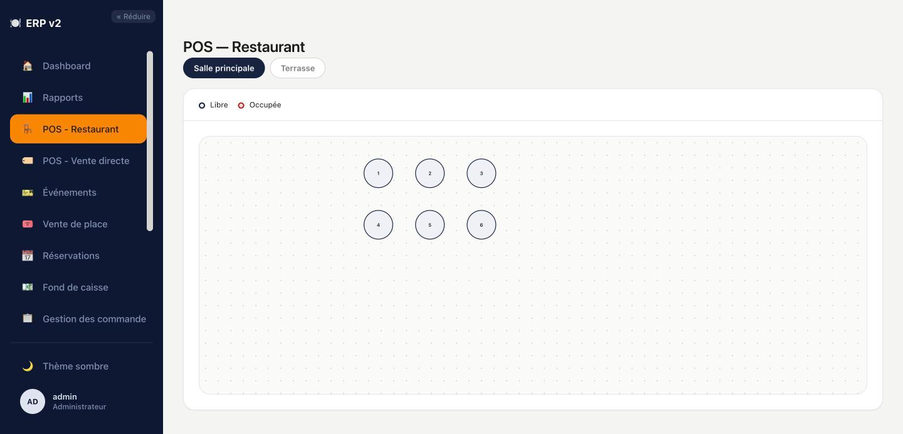

Une fois une table ouverte, sélection de produits par catégorie, séparés en sections
(la section visible ici, "Commande client 1", a été créée automatiquement par un client ayant
scanné le QR de la table — voir plus bas) :


Au moment du paiement, un code de réduction peut être saisi (voir Paramètres > Réductions) : le
montant déduit est toujours recalculé côté serveur, jamais celui affiché côté front.

### POS - Vente directe

Vente au comptoir, sans table ni suivi cuisine — encaissement immédiat. Même possibilité
d'appliquer un code de réduction au paiement que POS - Restaurant :

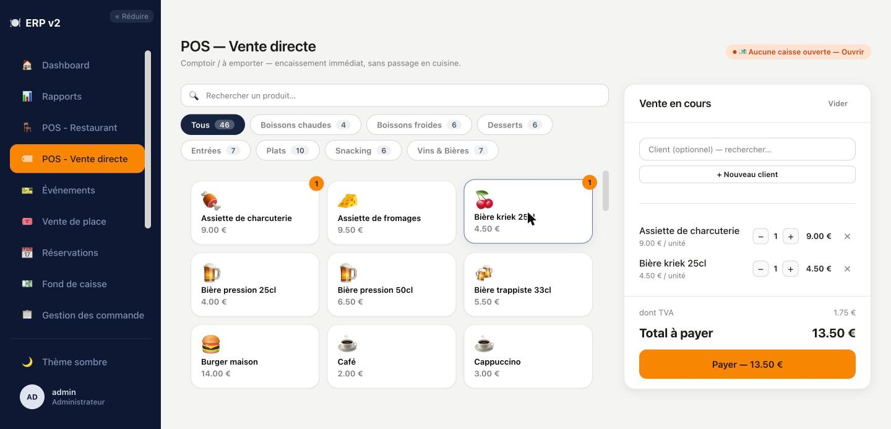

### Gestion des commandes

Vue liste de toutes les tables actuellement ouvertes (alternative au plan de salle), mise à jour
en direct :

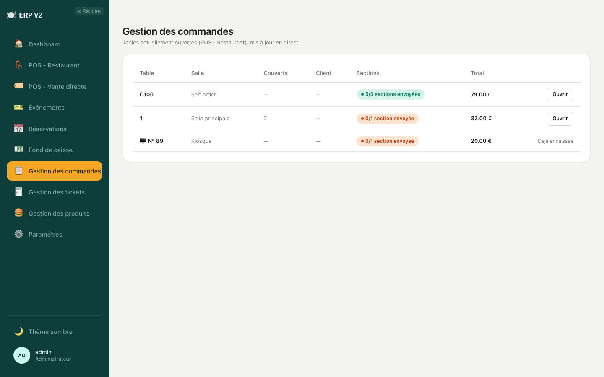

### Gestion des tickets

Historique des ventes encaissées (consultation et réimpression uniquement — un ticket payé est
une pièce comptable figée). Chaque ticket porte un badge **source** indiquant d'où il vient :
vente directe, POS Restaurant, self-order (QR) ou kiosque.

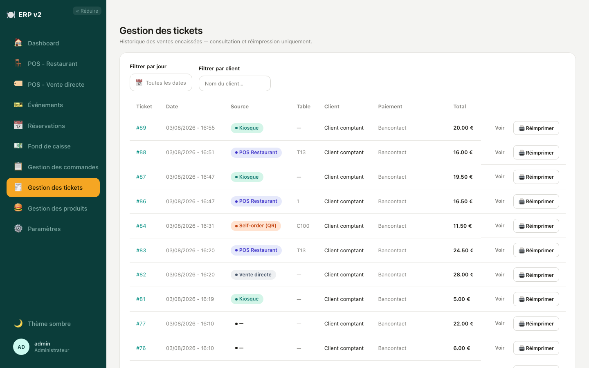

Détail d'un ticket, avec le reçu imprimable (répartition HT/TVA, moyens de paiement). Si une
réduction a été appliquée, elle apparaît en ligne à part et le total affiché est le montant net
réellement encaissé :

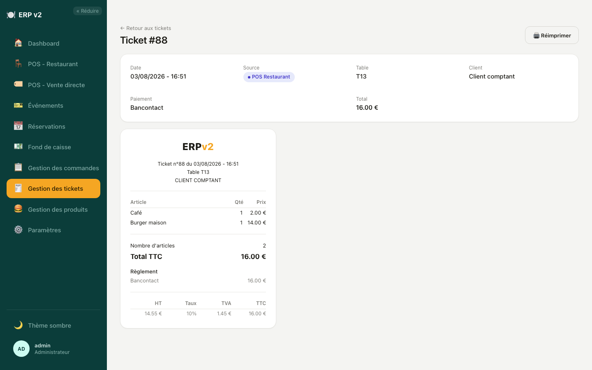

### Paramètres > Réductions

Gestion des codes de réduction (Paramètres > Réductions) : code, type (pourcentage, montant fixe
ou produit offert), période de validité, et un seuil d'éligibilité optionnel — un montant d'achat
minimum requis pour pouvoir utiliser le code (une fois ce montant atteint, la réduction s'applique
toujours en entier, jamais plafonnée). Ces codes sont utilisables au paiement dans POS - Vente
directe, POS - Restaurant et `erp_kiosk` (`erp_self_order` ne gère jamais de paiement lui-même, il
n'a donc pas d'UI dédiée aux réductions).

### Paramètres > Salles

Liste des salles (types Restaurant / Événement / **Self-order**) :

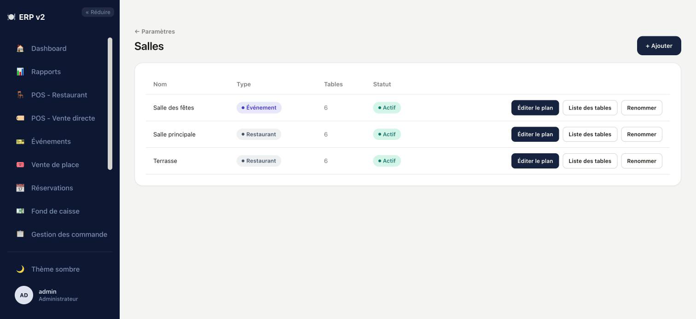

Éditeur de plan (tables, murs, textes libres) — chaque table dispose d'un QR code self-order
imprimable, généré automatiquement à sa création :

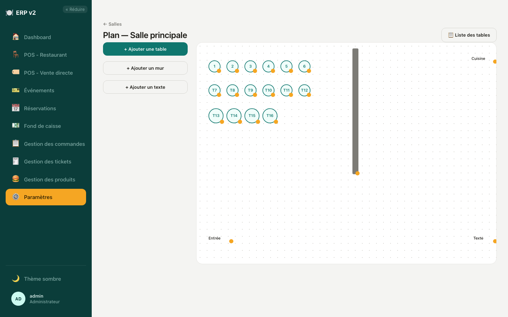

Vue liste des tables d'une salle — pratique pour imprimer les QR codes d'affilée sans cliquer sur
le plan table par table :

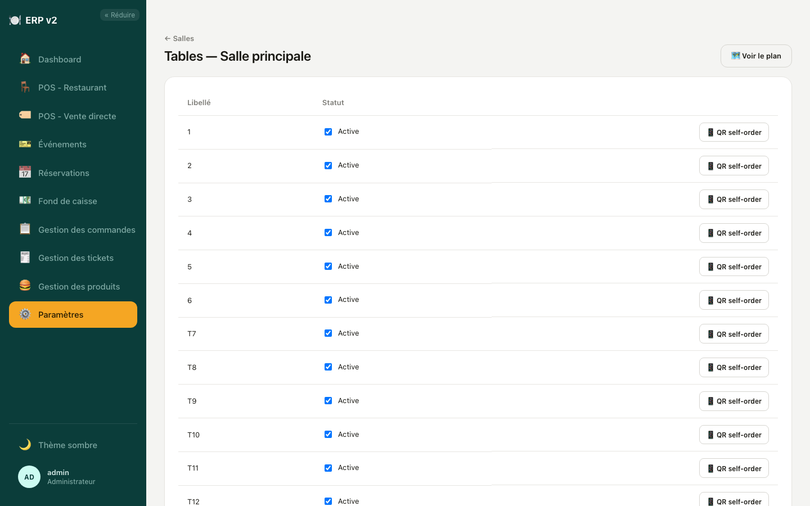

### Produits

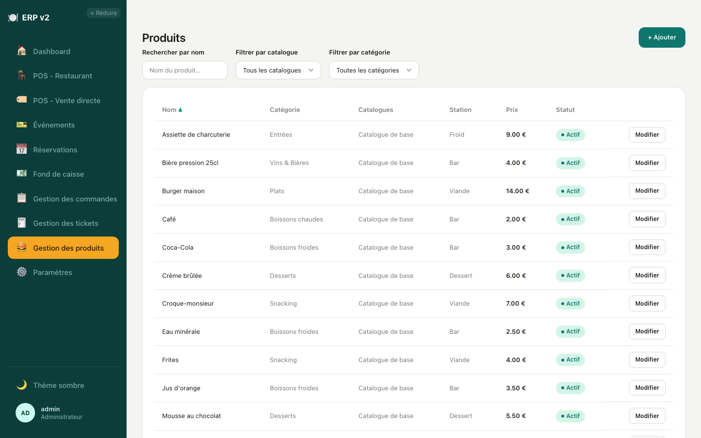

Fiche produit — le champ **Temps de préparation** alimente le minuteur du kitchen display :

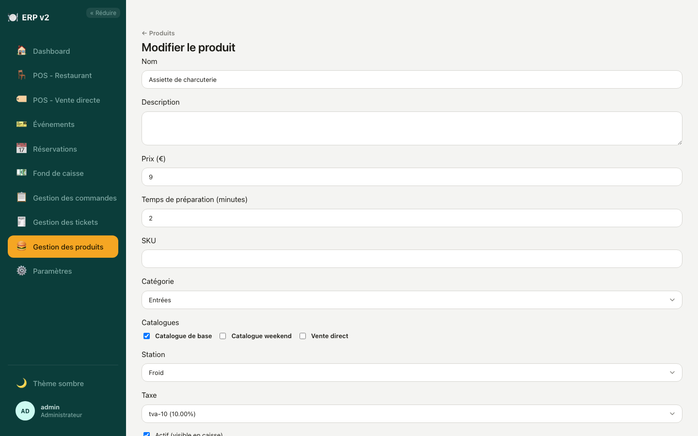

### Caisse

Ouverture/fermeture de session de caisse, comptage par moyen de paiement à la fermeture :

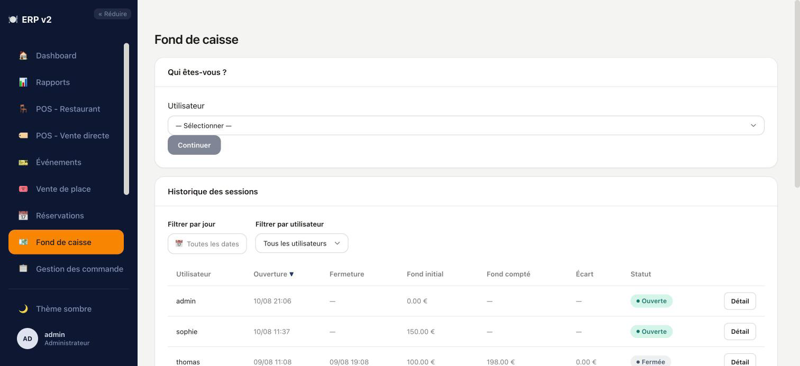

### Événements

Vente de places, validation par QR code, placement sur plan si événement à placement strict :

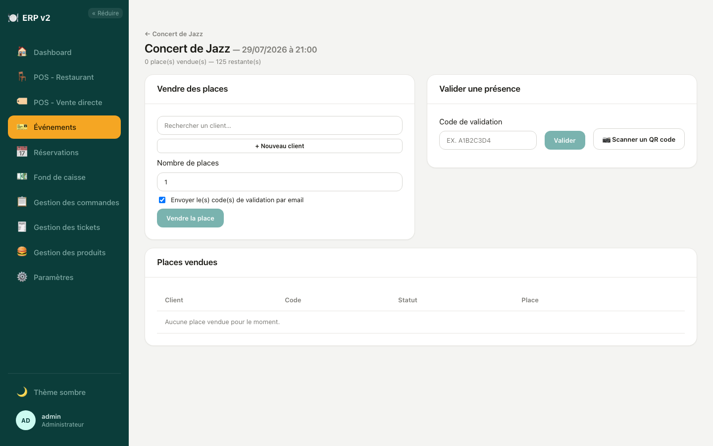

---

## `erp_kitchen_display` — écran cuisine

Écran dédié en cuisine, avec deux perspectives de filtrage indépendantes : par **poste** de
préparation (Bar, Dessert, Froid, Poisson, Viande...) ou par **passe** d'expédition. Chaque carte
affiche la table (ou, pour une commande kiosque, un gros numéro à annoncer au comptoir) et l'état
de chaque section :

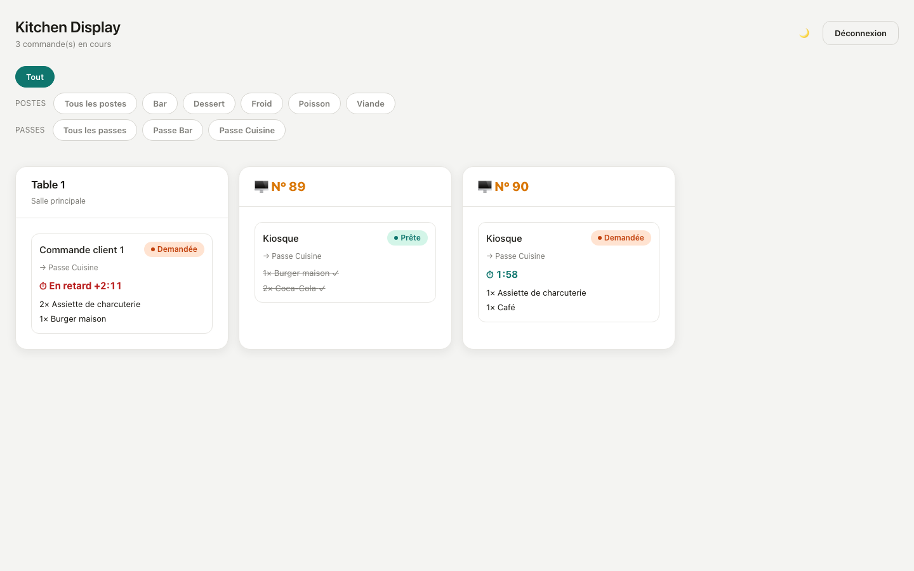

Cycle d'une section : `en_attente` → `send` (validée) → `ask` (demandée en cuisine) → `do`
(marquée faite) → `seed` (envoyée). Les postes ne peuvent que "marquer prête", les passes ne
peuvent qu'"envoyer" — séparation stricte des rôles. Notez le minuteur ⏱ rouge "En retard +2:11"
sur la Table 1 : le temps de préparation configuré sur les produits a été dépassé.

---

## `erp_validate_event` — validation d'entrée événement

Connexion par scan de badge personnel ou mot de passe (clavier visuel, pas de clavier physique
sur ce type de kiosque) :

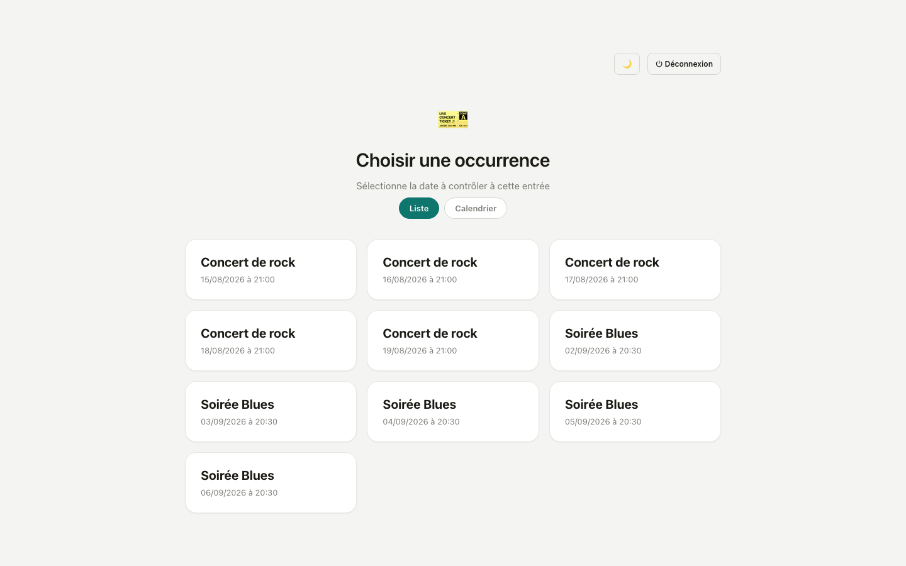

Sélection d'une date d'événement, puis validation des places par scan du QR code du billet
(placement sur plan si l'événement a un placement strict) :

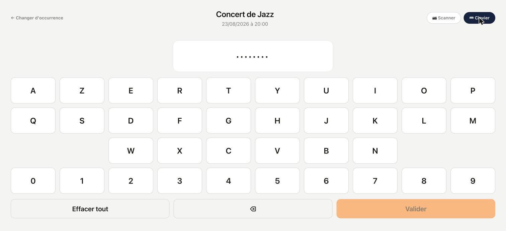

---

## `erp_self_order` — commande en libre-service

La grosse nouveauté de ce projet : permettre à un client de commander lui-même. Cette app est
volontairement limitée au mode QR — 100% public, aucune authentification, aucun encaissement :
c'est la seule surface exposée à un appareil client non maîtrisé (le téléphone personnel qui
scanne le QR), donc le mode kiosque (staff authentifié, caisse) vit dans une app séparée,
[`erp_kiosk`](#erp_kiosk--kiosque-de-commande-self-service).

### Mode QR (client anonyme, pas de paiement)

Le client scanne le QR code affiché sur sa table (ou une intégrée directement dans l'app via la
caméra) :

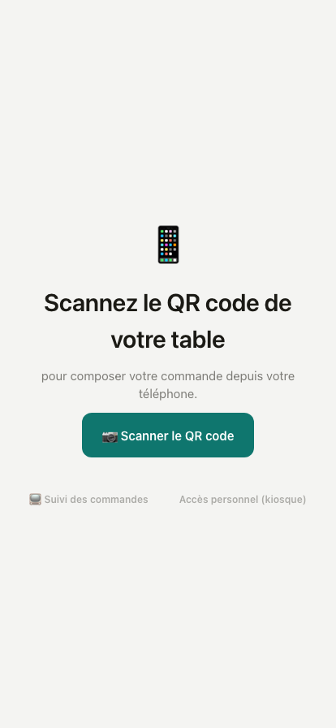

Il arrive directement sur le menu de sa table, sans jamais s'authentifier :

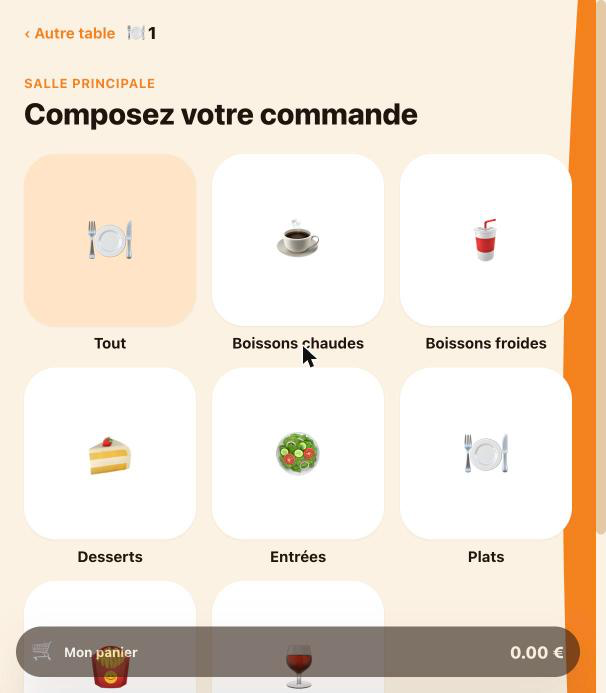

Ajout de produits au panier :

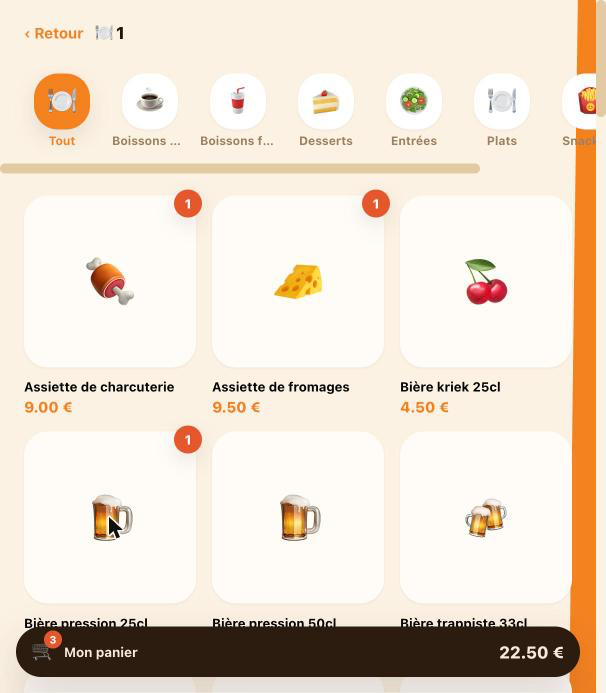

Récapitulatif avant envoi — un champ note optionnel par article (ex. "sans oignon"), visible en
cuisine mais jamais sur le ticket de caisse client :

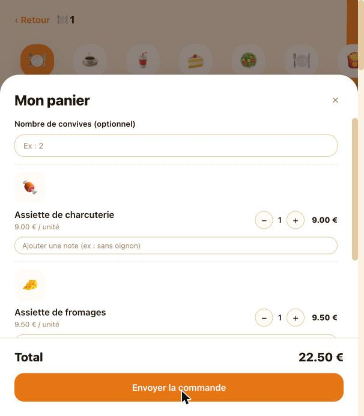

Contrairement à une section ajoutée depuis `erp-app`, une commande envoyée en mode QR passe
**directement** en état "Demandée" — le client valide lui-même en envoyant sa commande, elle
apparaît donc immédiatement en cuisine sans qu'un serveur ait à cliquer "Valider" puis "Demander".
**Le client ne paie jamais en mode QR** : un serveur encaisse ensuite depuis Gestion des commandes,
une fois le repas terminé.

---

## `erp_kiosk` — kiosque de commande self-service

App dédiée au mode kiosque (paiement immédiat, comme un fast-food) — séparée d'`erp_self_order`
pour que le code d'authentification et d'encaissement ne soit jamais servi à un appareil client
(voir la note en tête de la section précédente). Les captures ci-dessous datent d'avant la
séparation des deux apps, mais l'écran affiché est resté identique.

Un membre du personnel configure le kiosque une fois par service : connexion (scan badge ou
clavier visuel)...

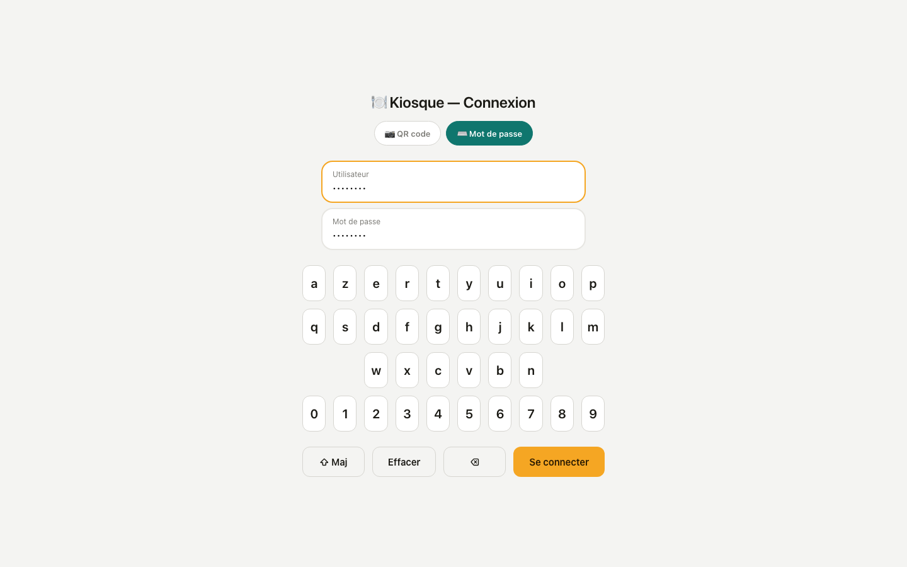

...puis vérification qu'une caisse est ouverte (obligatoire avant tout encaissement) :

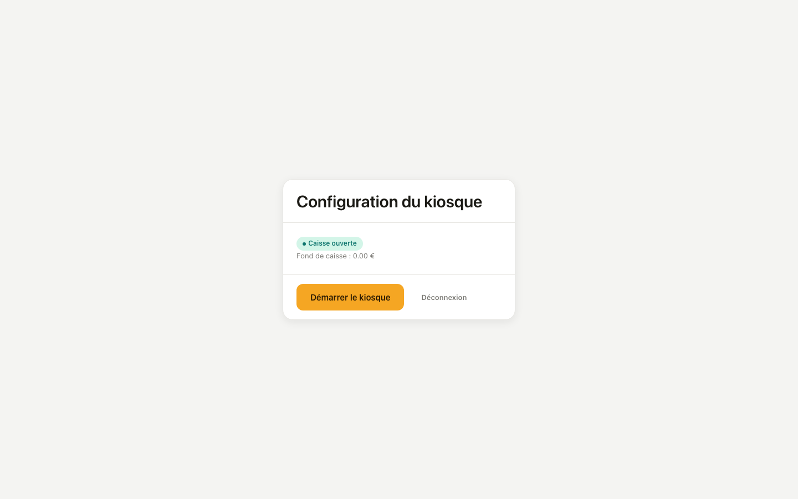

Le kiosque affiche ensuite un écran client en self-service, catalogue + panier :


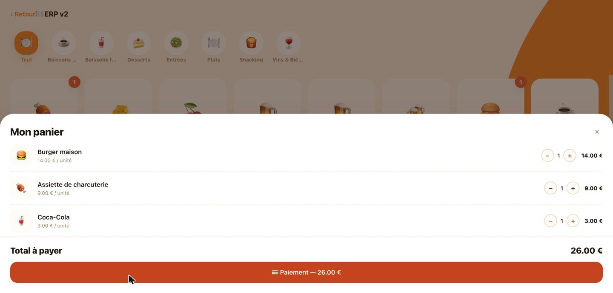

Comme dans `erp-app`, un code de réduction peut être saisi avant de choisir un moyen de paiement
(voir Paramètres > Réductions). Seuls deux moyens de paiement sont proposés au kiosque — QR code
ou terminal Bancontact (aucun vrai terminal n'étant intégré, chaque option ouvre un écran de
simulation) :

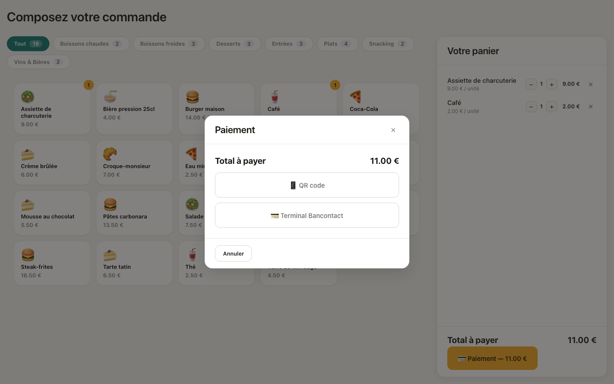

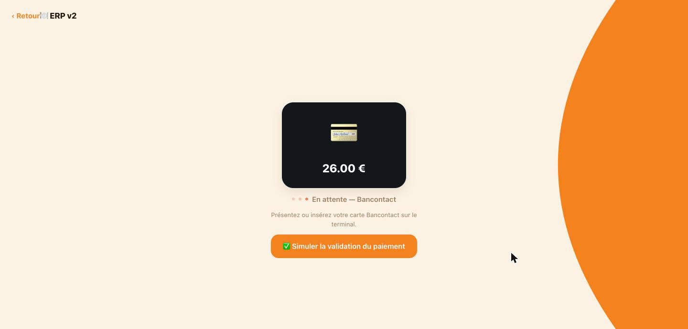

Une fois le paiement "validé", le kiosque affiche un reçu imprimable avec un **numéro de commande
en grand** — c'est ce numéro qui sera annoncé au comptoir quand la commande sera prête (retour
automatique à un panier vide 5 secondes plus tard, pour le client suivant) :

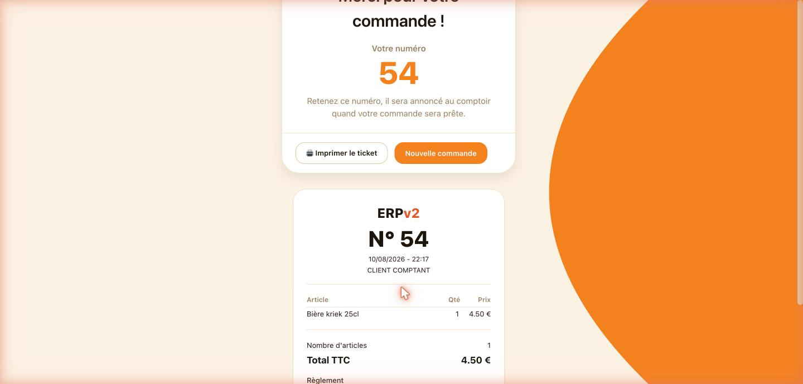

Un écran public "suivi des commandes" (pensé pour un moniteur près du comptoir, sans
authentification) affiche en direct les numéros en préparation et ceux prêts à récupérer — les
numéros affichés sont ceux des tickets kiosque (voir ci-dessus), pas des commandes QR
d'`erp_self_order` qui ne sont jamais numérotées :

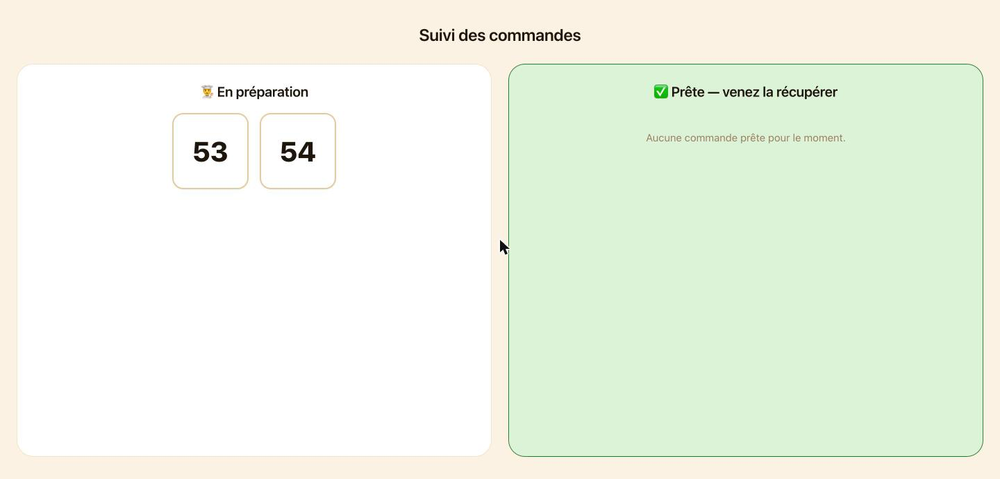

### Le casse-tête payer-immédiatement-ET-être-vu-en-cuisine

Aucun des deux circuits existants ne convenait tel quel pour le mode kiosque :

- **Order/OrderSection** (POS Restaurant) : visible en cuisine, mais le paiement est bloqué tant
  que toutes les sections ne sont pas entièrement servies — impossible de "payer d'abord".
- **Ticket** (vente directe) : payé immédiatement, mais jamais suivi en cuisine.

Solution retenue (`KioskOrderController`) : créer les **deux** dans la même transaction — un
`Ticket` (encaissement réel, immédiat) et une `Order` sans table (state `ask` dès la création,
juste pour piloter le kitchen display existant). Une fois la commande entièrement préparée et
servie, cette `Order` — déjà payée — se supprime automatiquement ; le `Ticket`, lui, reste comme
preuve de vente définitive.

---

## Le minuteur de préparation

Chaque produit peut avoir un **temps de préparation** (en minutes, voir capture "Fiche produit"
plus haut). Dès qu'une section passe en état "Demandée", un horodatage `asked_at` est enregistré
côté serveur. Le kitchen display affiche alors un décompte par section, basé sur le temps de
préparation le plus long parmi les produits de la section (on suppose une préparation en
parallèle) :

- 🟢 vert tant qu'il reste du temps
- 🔴 rouge clignotant, "En retard +mm:ss", une fois le temps dépassé

## Limitations connues

- Le mode kiosque simule les paiements Bancontact/QR (aucun vrai terminal de paiement intégré à
  ce projet — voir plus haut).
- Voir le [`Readme.md`](../Readme.md) racine pour le détail complet du schéma de base de données
  et la liste exhaustive des fonctionnalités livrées par module.
